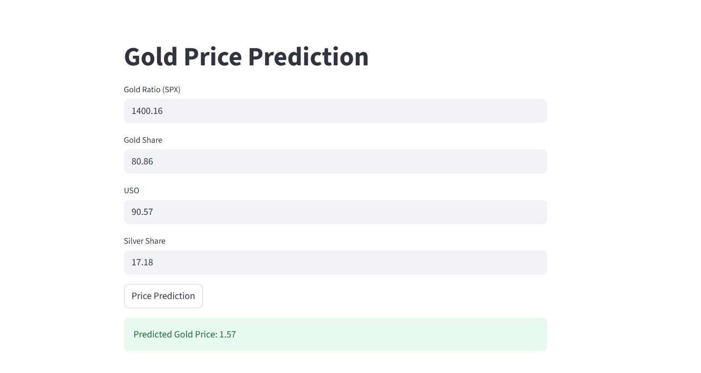

# Gold Price Prediction App

This project is a **machine learning web application** built with [Streamlit](https://streamlit.io/) that predicts the gold price based on several financial indicators. It uses a pre-trained model to provide predictions from user input.

## 📂 Project Structure

```
.
├── Gold_Price_App.py           # Streamlit app for interactive predictions
├── Gold_Price_Prediction.ipynb # Jupyter notebook for data analysis & model training
├── traine_model.sav            # Pre-trained ML model
├── Streamlit_UI.PNG            # Screenshot of the app
└── README.md                   # Project documentation
```

## 🚀 Features

- Interactive web interface for gold price prediction  
- Accepts **SPX (Gold Ratio)**, **GLD (Gold Share)**, **USO (Crude Oil Share)**, and **SLV (Silver Share)** as inputs  
- Uses a **pre-trained machine learning model** for instant predictions  
- Built with **Streamlit** for simplicity and ease of deployment  

## 📊 Model Training

The Jupyter Notebook `Gold_Price_Prediction.ipynb` contains the data preprocessing, feature selection, and training steps for the predictive model. You can retrain the model by running the notebook and saving the new `.sav` file.

## 🛠 Workflow Diagram

```mermaid
flowchart TD
    A[User Input: SPX, GLD, USO, SLV] --> B[Preprocessing: Convert to NumPy array]
    B --> C[Load Pre-trained Model (traine_model.sav)]
    C --> D[Model Predicts Gold Price]
    D --> E[Display Result in Streamlit UI]
```

## 📸 Screenshot

  
*Example of the app interface and prediction result.*

## 🛠 Technologies Used

- **Python 3**  
- **Streamlit** — for the interactive interface  
- **NumPy** — for numerical computations  
- **Scikit-learn** — for machine learning model handling  
- **Pickle** — for model serialization  
